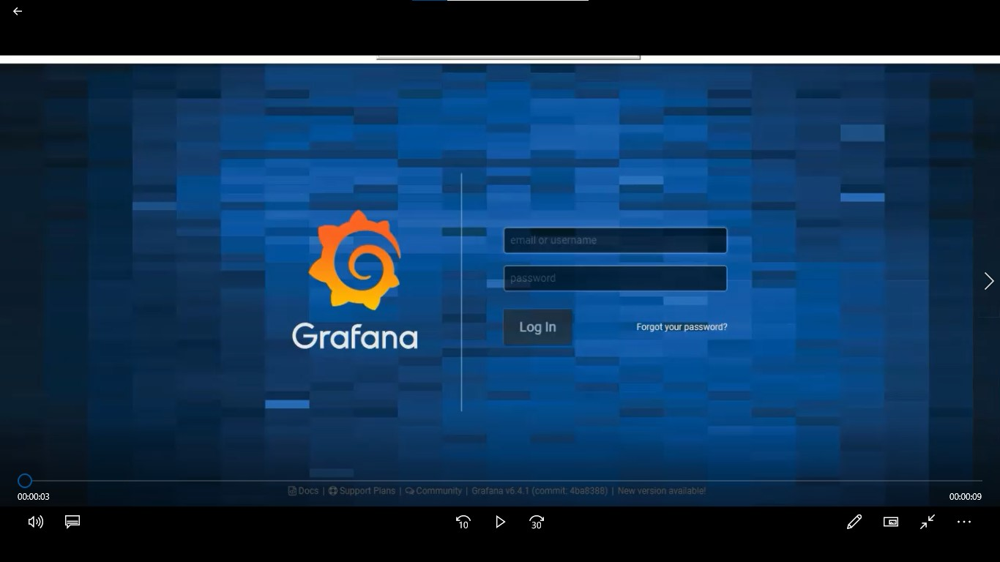

# Final Project - Infrastructure for Automation Testing

Full Stack Test Automation - Final Project

## Description
This project offer a central infrastructure for automation testing for different application:
* Web base application
* Mobile application
* Desktop 
* Electron
* Web API

## Applications that were used in this project
* Grafana webpage - Web based application
* Mortgage calculator - Mobile application
* Grafana API - Web API
* TodoList - Electron application
* Windows calculator - Desktop application
	
## Frameworks and Tools used in the project
* TestNG - Testing Framework
* REST Assured - for API testing
* Sikuli - GUI Automation Tool
* Listeners - interface used to generate logs and customize the TestNG reports
* MySQL Free Online DB - used for login to Grafana web page
* Jenkins- for tests execution
* Allure Reports - as the main reporting system
	
## Infrastructure project includes using
* Page Object Design Pattern
* Support of Different Clients/Browsers
* Test-driven development
* Failure Mechanism
* External Files Support
* Reporting System (including screenshots and video)
* Visual Testing
* DB support
* CI support

## Tests Execution
For each of the application there is a few functional TC that demonstrate flow and purpose.
This can be a base for design and implement tests scenario

## Screenshot and Videos

**Reports:**

   

**Mobile:**

  

**Web Testing (*Video*):**

